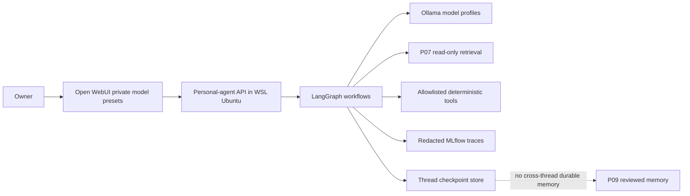

# P08: Practical Personal Agents

**Depends on:** P07

**Required outcome:** Five useful, private, evaluated personal agents run locally through Open WebUI with explicit safety boundaries, approved read-only capabilities, and no silent durable memory.

**Status:** Planned

## Gate

P07 must be Done, its accepted retrieval interface must be available, and the owner must authorize the revision-bound P08 activation packet. Research and learning may occur earlier; deployment and real-data testing cannot cross this gate.

## Fixed architecture

- Open WebUI is the owner-facing interface. Each agent is a private, named preset backed by the shared agent API; raw base models remain distinguishable.
- LangGraph owns orchestration, bounded tools, interrupts, and replay-safe thread checkpoints. Checkpoints resume a conversation; they are not durable personal memory.
- The P03 accepted primary model serves thought partnering, planning, fitness, and financial education. The accepted fast model serves daily check-ins when it passes the same safety floor.
- Only P06-approved tools and the P07 read-only retrieval contract are eligible. Retrieved text, skills, assets, and tool output are untrusted data and cannot alter policy or authorization.
- P09 is the only phase allowed to add reviewed cross-session memory. P08 may export a user-previewed Markdown plan or check-in only after explicit confirmation.
- MLflow receives redacted structure and evaluation traces. Raw private conversation text is off by default.
- Private runtime state and confirmed exports live only beneath activation-resolved subpaths of `H:\ai\agents\personal`; they never enter this public playbook repository. Repository evidence is synthetic, redacted, or aggregate, and P10 later applies the selected backup policy.

## Non-negotiable boundaries

All five agents disclose their role, active provider/model, limits, data access, and that durable memory is off. They cite sourced claims, distinguish facts from suggestions, expose uncertainty, and abstain when necessary. No agent may diagnose, treat, prescribe, trade, transfer funds, provide fiduciary/tax/legal advice, impersonate a licensed professional, claim sentience or exclusivity, discourage human relationships, execute arbitrary shell/browser/filesystem/network actions, or silently write personal data.

Thought-partner safety uses layered deterministic checks, model behavior, and regression tests. It supports reflection but is not therapy; urgent danger is routed to current-region emergency resources, with 988 offered only where applicable. Fitness guidance remains educational and escalates symptoms, injuries, eating-disorder concerns, medication questions, and relevant medical constraints. Financial guidance is educational and uses deterministic, inspectable calculations.

## Current source baseline (refresh at activation)

- [Open WebUI: connect an agent](https://docs.openwebui.com/getting-started/quick-start/connect-an-agent/)
- [Open WebUI: OpenAI-compatible connections](https://docs.openwebui.com/getting-started/quick-start/connect-a-provider/starting-with-openai-compatible/)
- [Open WebUI: workspace models](https://docs.openwebui.com/features/workspace/models/)
- [LangChain: human-in-the-loop middleware](https://docs.langchain.com/oss/python/langchain/human-in-the-loop)
- [LangChain: guardrails](https://docs.langchain.com/oss/python/langchain/guardrails)
- [LangGraph: interrupts](https://docs.langchain.com/oss/python/langgraph/interrupts)
- [MLflow: evaluating agents](https://mlflow.org/docs/latest/genai/eval-monitor/running-evaluation/agents/)
- [MLflow: regression testing](https://mlflow.org/docs/latest/genai/eval-monitor/regression-testing/)
- [OWASP Top 10 for Agentic Applications](https://genai.owasp.org/download/52117/)
- [988 Lifeline: get help](https://988lifeline.org/help-yourself/)
- [CDC: physical activity for adults](https://www.cdc.gov/physical-activity-basics/adding-adults/index.html)
- [CFPB: Your Money, Your Goals toolkit](https://www.consumerfinance.gov/consumer-tools/educator-tools/your-money-your-goals/toolkit/)
- [Investor.gov: artificial-intelligence fraud alert](https://www.investor.gov/introduction-investing/general-resources/news-alerts/alerts-bulletins/investor-alerts/artificial-intelligence-fraud)

## Story sequence

| Seq. | Story | Step | Risk |
|---:|---|---|---|
| 1 | [P08-S001: Research current personal-agent patterns and safety](../../stories/P08/P08-S001-research-current-personal-agent-patterns-and-safety.md) | Research | Low |
| 2 | [P08-S002: Learn practical agent design and boundaries](../../stories/P08/P08-S002-learn-practical-agent-design-and-boundaries.md) | Learning | Low |
| 3 | [P08-S003: Define the shared personal-agent contract](../../stories/P08/P08-S003-define-the-shared-personal-agent-contract.md) | Implementation | Medium |
| 4 | [P08-S012: Deploy the shared personal-agent runtime](../../stories/P08/P08-S012-deploy-the-shared-personal-agent-runtime.md) | Implementation | High |
| 5 | [P08-S004: Build the thought-partner agent](../../stories/P08/P08-S004-build-the-thought-partner-agent.md) | Implementation | High |
| 6 | [P08-S005: Build the life-planning agent](../../stories/P08/P08-S005-build-the-life-planning-agent.md) | Implementation | High |
| 7 | [P08-S011: Build the daily-check-in agent](../../stories/P08/P08-S011-build-the-daily-check-in-agent.md) | Implementation | High |
| 8 | [P08-S006: Build the fitness-coach agent](../../stories/P08/P08-S006-build-the-fitness-coach-agent.md) | Implementation | High |
| 9 | [P08-S007: Build the financial-education agent](../../stories/P08/P08-S007-build-the-financial-education-agent.md) | Implementation | High |
| 10 | [P08-S008: Integrate approved RAG sources with least privilege](../../stories/P08/P08-S008-integrate-approved-rag-sources-with-least-privilege.md) | Implementation | Critical |
| 11 | [P08-S009: Evaluate agents across models and risks](../../stories/P08/P08-S009-evaluate-agents-across-models-and-risks.md) | Testing | High |
| 12 | [P08-S010: Perform personal-agent owner acceptance](../../stories/P08/P08-S010-perform-personal-agent-owner-acceptance.md) | Human Validation | Critical |

## Completion

All five private Open WebUI agents pass deterministic, adversarial, privacy, role-boundary, retrieval, restart, and rollback tests on their accepted model profiles. Cross-provider engineering review is resolved, owner acceptance is genuine, durable memory remains absent, and every non-superseded story is Done with complete evidence.
