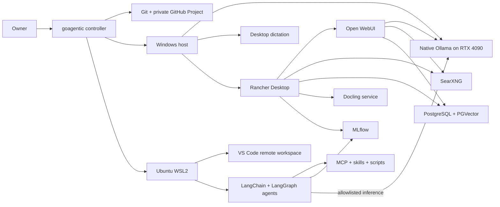

# Local AI and Agentic Workstation Program

**Program ID:** `LAW-WIN`  
**Portfolio name:** Local AI Workstation Playbook  
**Active platform:** Windows 11  
**Reference hardware:** Ryzen 7 9800X3D, RTX 4090 24 GB, 64 GB RAM  
**Primary data root:** `H:\ai`  
**Status:** Approved design; implementation not started  
**Last reviewed:** 2026-09-13

## 1. Purpose

Build a private, open-source-first Windows workstation for local inference, document and web retrieval, desktop dictation, software development, and the deliberate creation of capable personal agents. The work is a learning program as well as an installation program: targeted human learning gates precede each major new concept, and implementation pauses until the owner completes them.

The program is executable as small, independently testable stories. It must survive closed applications, model changes, reboots, provider changes, and multi-week pauses without relying on chat memory.

## 2. Outcomes

The completed Windows program provides:

- Open WebUI as the primary local AI interface.
- Native Ollama inference optimized and measured on the RTX 4090.
- Rancher Desktop with Moby/dockerd and Kubernetes disabled for supporting services.
- SearXNG live search, Docling document conversion, PostgreSQL with PGVector, and local embeddings.
- Windows-wide local dictation selected by an evidence-based comparison rather than brand preference.
- Windows VS Code using a dedicated Ubuntu WSL2 development and agent environment.
- Python, Go, Node.js, and TypeScript development toolchains inside Ubuntu.
- Codex CLI and Claude Code workflows inside Ubuntu, plus accurate compatibility guidance for desktop ChatGPT and Claude products.
- LangChain and LangGraph agent development, MCP tools, reusable skills/assets/scripts, and self-hosted MLflow tracing and evaluation.
- A reproducible ingestion system for PDF, DOCX, XLSX, PPTX, Markdown, public and authorized authenticated websites, Google Docs, Google Sheets, and Google Slides.
- At least one substantial personal knowledge base and one useful RAG application built with Langflow.
- Practical personal agents with explicit safety and professional-advice boundaries.
- A reviewed-inbox durable memory system selected after a current OSS framework evaluation.
- Idempotent installation, verification, update, backup, restore, rollback, troubleshooting, and removal guidance.

## 3. Boundaries

### Included

- One Windows workstation and one dedicated Ubuntu WSL2 distribution.
- Localhost-only services except a narrowly firewalled inference path from Ubuntu to native Windows Ollama.
- Personal, single-user operation.
- GitHub Projects as a visible progress board, backed by repository state.
- Cloud models early in the program and qualified local models later.
- A separate optional local VS Code autocomplete setup guide.
- A separate optional LM Studio evaluation guide using localhost port `51239`, without sharing Ollama model files. Activation must verify that the port is free and may select another unoccupied dynamic/private port if necessary.

### Deferred to a separate future program

- The independent M4 Pro MacBook installation and its 175 GB budget.
- A coding-factory or software-factory architecture.
- Selection or implementation of a general multi-agent coding harness.
- Cross-machine serving or synchronization.
- Internet-facing or multi-user hosting.

Deferred work may be researched, but it cannot silently enter an active Windows story.

## 4. Program architecture



Ollama serves models; it is not the agent framework. LangChain supplies model/tool abstractions, LangGraph supplies durable agent orchestration, MCP and local assets supply capabilities, and MLflow supplies self-hosted traces, outputs, decisions, and evaluation records.

## 5. Planned sequence

| Phase | Name | Required outcome | Depends on |
|---|---|---|---|
| P01 | [Program Control and Quality Foundation](../phases/P01-program-control-and-quality-foundation.md) | Trusted `goagentic` workflow and visible board | None |
| P02 | [Windows, WSL, Git, and VS Code Foundation](../phases/P02-windows-wsl-git-and-vs-code-foundation.md) | Protected Ubuntu development environment | P01 |
| P03 | [Local Inference and Model Foundation](../phases/P03-local-inference-and-model-foundation.md) | Qualified Ollama models on the RTX 4090 | P02 |
| P04 | [Open WebUI and Supporting AI Services](../phases/P04-open-webui-and-supporting-ai-services.md) | Verified local AI service stack | P03 |
| P05 | [Desktop and Development Tool Integrations](../phases/P05-desktop-and-development-tool-integrations.md) | Dictation and supported client workflows | P04 |
| P06 | [Agent Engineering Foundation](../phases/P06-agent-engineering-foundation.md) | Traced LangChain/LangGraph agent with real tools | P05 |
| P07 | [RAG, Ingestion, and Knowledge-Base Capstone](../phases/P07-rag-ingestion-and-knowledge-base-capstone.md) | Reproducible multi-format private knowledge base | P06 |
| P08 | [Practical Personal Agents](../phases/P08-practical-personal-agents.md) | Evaluated useful personal-agent profiles | P07 |
| P09 | [Durable Agent Memory](../phases/P09-durable-agent-memory.md) | Reviewed-inbox memory integrated with an agent | P08 |
| P10 | [Operations and Final Acceptance](../phases/P10-operations-and-final-acceptance.md) | Recoverable, tuned, documented accepted system | P09 |

A later phase may be designed while the current phase is executing. Implementation cannot cross a phase gate until its dependencies, learning, tests, review, and required owner validation are complete.

The first P01 story bootstraps a personal GitHub Project and imports every approved story as a draft item before controller or workstation work proceeds. This keeps the entire plan visible from the start without flooding the public repository with inactive issues. Stories become repository issues when they become Ready; automated synchronization replaces manual bootstrap maintenance later in P01.

## 6. Learning policy

A human learning story precedes each major concept. Each module is narrowly tailored to the next implementation work and includes current official documentation, a recently verified short conceptual resource when useful, a deeper tutorial when warranted, a hands-on exercise, and an observable explain-back. Implementation pauses until the owner records completion.

Learning sources are researched when the story activates. Popularity is supporting evidence, not a substitute for currency, technical accuracy, maintainer credibility, and version match.

The future macOS program must include its own full training path so it can execute independently. For the same owner, unchanged general material may be marked `Satisfied by prior learning` only when it links exact Windows evidence and passes a current-source retention and delta check. Material changes require a targeted refresher or relearning. macOS-specific subjects—including unified memory, Metal or MLX, permissions, filesystem and service behavior, the 175 GB limit, and platform-specific Ollama or Rancher Desktop operation—remain mandatory.

## 7. Model policy

The September 2026 planning baseline is:

| Role | Initial recommendation | Starting context | Status |
|---|---|---:|---|
| Windows primary vision/general | `qwen3.8:27b-q4_K_M` | 16K | Must be benchmarked |
| Windows fast/worker | `qwen3.5:9b-q4_K_M` | 16K | Must be benchmarked |
| Embedding | `qwen3-embedding:0.6b` | Model default | Must pass retrieval tests |
| Optional autocomplete | `qwen2.5-coder:1.5b-base` | Small | Separate opt-in guide |

The registry lists Qwen3.8 27B Q4 at about 18 GB with image input and Qwen3.5 9B Q4 at about 6.6 GB. Advertised 256K context is not the operating default; context is raised only after VRAM, latency, stability, and quality measurement. Exact tags, licenses, hashes, tool behavior, and better candidates are refreshed in P03 before any pull.

Early plan execution uses cloud models. After local models pass representative evaluations, P03 includes a mandatory reassessment of every remaining unstarted story. Local models enter probation first; cloud review remains mandatory until role-specific evidence justifies qualification.

## 8. Storage policy

Workstation application data is rooted at `H:\ai`. Knowledge bases use two physically separate trees:

```text
H:\ai\
├── knowledge-sources\<knowledge-base-id>\
│   ├── originals\
│   ├── docling-json\
│   ├── manifests\
│   └── failed\
└── knowledge-repos\<knowledge-base-id>\
    ├── content\
    ├── assets\
    ├── indexes\
    ├── schemas\
    └── tests\
```

Original documents and lossless extraction records never enter Git. Final Markdown with YAML frontmatter and meaningful derived visual assets live in a separate local Git repository. Each knowledge-base repository begins without a remote; a remote may be added only with human approval and must be private personal or business-organization storage, never public. Source backups are provider-neutral so OneDrive, a private NAS, or both can be selected later.

The preflight computes required storage from actual selected models and retention rather than assuming a universal number. It must include WSL, containers, model blobs, immutable source versions, Markdown/assets, vector indexes, logs, and at least one restorable backup generation, then retain an owner-approved growth margin.

## 9. Security principles

- Services bind to loopback by default.
- The dedicated Ubuntu distribution does not receive broad Windows filesystem, credential, or container-engine access.
- Agent repositories live on the Linux filesystem.
- Credentials are stored once per security environment, not per repository. Windows and hardened Ubuntu remain separate credential boundaries.
- No automation bypasses access controls, CAPTCHAs, paywalls, or site terms.
- Authenticated scraping requires proof of authorization, isolated credential handling, Critical risk approval, and sanitized evidence.
- Real personal documents and generated private knowledge content never enter this public playbook repository.
- Privileged work receives one explicit approval per bounded phase, then proceeds through logged, reversible operations.

## 10. Quality policy

Every story conforms to the canonical contract. Blank, omitted, unfinished-marker, boilerplate alternative, and unexplained not-applicable values fail validation. Risk is named `Low`, `Medium`, `High`, or `Critical`; the highest applicable impact dimension wins. An LLM may raise risk but cannot lower it. Lowering risk requires owner approval and a durable rationale.

Before a story becomes Ready, a versioned activation packet resolves its exact targets, versions, tests, route, approvals, checkpoints, and rollback from current evidence. This preserves fresh recommendations without asking an executing LLM to invent missing scope. The packet may resolve variables but cannot broaden the approved objective.

Implementation and review are separate activities. High-risk architecture or security changes require cross-provider review and owner validation. Tests, idempotency, rollback, evidence, and research freshness are enforced by tooling rather than accepted from model confidence.

Specification quality uses a bounded correction loop: structural validation, story-level semantic review, correction, cross-document trace, current-source review, and a fresh parent-to-leaf pass. A review may claim completion only after two consecutive full passes find no material defect. Each batch stops after five correction cycles; unresolved material defects are reported and remain blocking rather than being relabeled as minor. A material defect changes scope, safety, executability, testability, traceability, factual currency, or workflow integrity.

## 11. Success criteria

The program is complete only when:

1. The owner can return after a reboot and receive exactly one safe next action from `goagentic`.
2. Every phase and story has accepted evidence and no bypassed learning or human gate.
3. Ollama and the service stack are measured on the reference hardware.
4. VS Code, Codex CLI, and Claude Code operate through the documented Ubuntu boundary.
5. The knowledge-base pipeline passes synthetic fixtures and three owner-provided samples in each of nine source categories.
6. The personal RAG capstone answers an agreed evaluation set with source citations and recorded retrieval quality.
7. Agent traces, tool calls, decisions, and outputs are inspectable in self-hosted MLflow.
8. At least one practical agent uses the reviewed-inbox durable memory system.
9. Backup and restore are proven in an isolated target.
10. Installation and maintenance are idempotent, reversible, and documented for a nonexpert operator.

## 12. Current primary references

These references were checked on 2026-09-13. Activated stories must recheck the sources relevant to their work.

- [Ollama Qwen3.8 tags](https://ollama.com/library/qwen3.8/tags)
- [Ollama Qwen3.5 tags](https://ollama.com/library/qwen3.5/tags)
- [Docling supported formats](https://docling-project.github.io/docling/usage/supported_formats/)
- [Docling serialization trade-offs](https://docling-project.github.io/docling/concepts/serialization/)
- [Open WebUI essentials](https://docs.openwebui.com/getting-started/essentials/)
- [Open WebUI SearXNG integration](https://docs.openwebui.com/features/chat-conversations/web-search/providers/searxng/)
- [Rancher Desktop installation](https://docs.rancherdesktop.io/getting-started/installation/)
- [LangChain framework and runtime overview](https://docs.langchain.com/oss/python/concepts/products)
- [LangGraph overview](https://docs.langchain.com/oss/python/langgraph/overview)
- [MLflow agent tracing](https://mlflow.org/docs/latest/genai/tracing)
- [Crawl4AI documentation](https://docs.crawl4ai.com/)
- [Google Workspace export formats](https://developers.google.com/workspace/drive/api/guides/ref-export-formats)
- [IANA service-name and port-number registry](https://www.iana.org/assignments/service-names-port-numbers)

## 13. Change control

New phases receive new stable phase IDs and do not renumber existing phases. A request that changes architecture, scope, privacy, risk, or acceptance criteria becomes an explicit design-change story. Superseded documents remain in Git history; active documentation contains only the current decision.
