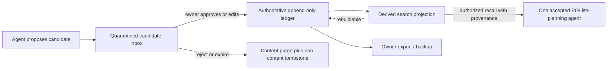

# Durable Agent Memory System Specification

**System ID:** `SYS-MEM`

**Status:** Approved architecture; implementation framework deliberately selected at P09 activation

**Primary phase:** P09

**Last reviewed:** 2026-09-14

## 1. Purpose and owner promise

Give approved personal agents useful cross-session continuity without allowing a model, retrieved document, tool, or memory framework to turn an inference into permanent truth. Agents may automatically append bounded candidate memories to a quarantined inbox. Only the owner may promote, edit, merge, restrict, correct, or delete durable memory. No deterministic rule and no agent may bypass that review.

The system is local-first, self-hosted, inspectable, framework-replaceable, and usable through the P08 agents in Open WebUI. A separate private local inbox is allowed for memory administration because approval is an operator function, not a chat response.

## 2. Authority and data layers

| Layer | Authority | Required behavior |
|---|---|---|
| P08 thread checkpoint | Conversation continuity only | Scoped to one thread; never promoted implicitly |
| Candidate inbox | Untrusted quarantine | Not retrievable by agents; expires; preserves bounded source context for review |
| Durable ledger | System of record | Append-only versions, owner decision receipt, provenance, access policy, correction/supersession |
| Search projection | Derived | Vector, graph, full-text, or hybrid; disposable and rebuildable from the ledger |
| Sanitized audit | Operational evidence | IDs, decisions, hashes, timing, and denials; no restricted/raw values |

The authoritative ledger is framework-neutral and exportable. A selected OSS framework may implement extraction, search, or projection, but its proprietary or opaque store cannot be the only copy of an approved memory.

## 3. Memory classes and lifecycle

| Class | Purpose | Durable? | Promotion |
|---|---|---:|---|
| Thread context | Resume one Open WebUI conversation | Limited by P08 retention | Never |
| Candidate | Proposed preference, fact, goal, event, relationship, or correction | Temporary | Owner review required |
| Shared | Approved stable context usable by named agents | Yes | Owner approval/edit/merge |
| Agent-private | Approved domain context for one named agent | Yes | Owner approval/edit/merge |
| Restricted | Approved sensitive context with narrower retrieval/export/retention | Yes | Separate explicit owner action |

Candidate states are `Pending`, `Deferred`, `Approved`, `Edited and approved`, `Merged`, `Rejected`, `Expired`, or `Quarantined`. Only Pending and Deferred contain reviewable candidate content. Approved content is copied into a new immutable ledger version; rejected/expired content is purged after the accepted retention window. Corrections append a superseding version. Owner deletion purges content from the live ledger, projections, caches, and deletion-aware backup schedule while retaining only a non-content tombstone needed to prevent resurrection.

## 4. Canonical record

Every candidate and durable version has a stable ID, class, owner/subject ID, namespace, normalized assertion, assertion type, source agent, source interaction reference and content hash, bounded review excerpt, event/observed/created times, model/provider/prompt/extractor versions, confidence labeled as model output rather than truth, candidate state, owner decision receipt, reviewer time, edit/merge rationale, sensitivity, allowed agent IDs, retention/expiry, predecessor/supersession IDs, projection IDs, and integrity hash.

No password, token, private key, authentication secret, full financial-account number, or other denylisted secret may enter any layer. Health and financial details default to Restricted when allowed at all. The owner may mark a conversation `do not learn`; capture then produces no candidate or hidden trace.

## 5. Capture, review, and recall

- Capture is off until P09 acceptance and remains independently switchable per agent and conversation.
- Candidate extraction receives the minimum necessary turn window, produces structured assertions, and passes deterministic secret/PII/sensitivity/deduplication checks before quarantine.
- Candidates never influence answers. The inbox shows source context, proposed class/namespace, possible duplicate or conflict, sensitivity, expiry, and approve, edit, merge, reject, defer, restrict, or purge actions. Bulk approval is disabled in this phase.
- Every owner action uses a fresh anti-replay decision token bound to candidate hash, action, target namespace, policy revision, and expiry. The agent that proposed a candidate cannot approve it.
- Recall accepts a typed purpose, owner identity, calling agent ID, allowed namespaces, query, maximum results/tokens, and minimum status. It returns only current approved versions with provenance and an explicit “no accepted memory found” outcome.
- Retrieved memory is untrusted context, never policy. It cannot grant tools, change identity, weaken safety, or create another memory. Conflicts, stale facts, and low-confidence matches are shown, not silently resolved.

## 6. Isolation, privacy, and operations

Persistent state lives beneath activation-resolved subpaths of `H:\ai\agents\memory` and the accepted Rancher data boundary. Services bind only to the private Rancher network plus a loopback owner-administration path, use separate least-privilege database/service identities, and keep secrets outside Git. The public playbook contains only schemas, synthetic fixtures, hashes, aggregate results, and sanitized evidence.

At-rest protection, database choice, projection backend, and application-level encryption are resolved in the ADR from verified threat model and current platform support. Encryption must not make deterministic export, deletion, restore, or key recovery untestable. MLflow records redacted decision structure and quality metrics; it never receives candidate excerpts, durable values, restricted values, raw conversation text, or encryption keys.

Memory outage, timeout, schema mismatch, authorization ambiguity, corrupt projection, or stale policy fails closed to the stateless P08 agent. It must visibly disclose that memory was unavailable; it cannot guess continuity.

## 7. Framework selection boundary

P09-S001 evaluates at minimum current OSS Mem0, LangGraph Store/LangMem, Graphiti, Letta, Cognee, Hindsight, Supermemory, and credible new alternatives. The scorecard distinguishes repository code from managed/SaaS claims and separately tests local Ollama support. It measures license, maintenance/security, full self-hosting, Windows/WSL/Rancher compatibility, resource cost beside the 4090 stack, LangChain/LangGraph fit, typed APIs, provenance, namespaces, deletion/export, observability, offline behavior, migration, and ability to sit behind this reviewed-ledger contract.

The ADR may choose a thin composable LangGraph/PostgreSQL design if no framework meets the contract. Framework-native auto-retain, self-editing identity, dreaming/reflection, global recall, cloud sync, telemetry, and autonomous memory consolidation are disabled unless separately evaluated and owner-approved in a future phase.

## 8. Current source baseline (refresh at activation)

- [LangChain memory concepts](https://docs.langchain.com/oss/python/concepts/memory)
- [LangGraph long-term memory](https://docs.langchain.com/oss/python/langgraph/add-memory)
- [LangMem repository and concepts](https://github.com/langchain-ai/langmem)
- [Mem0 OSS repository](https://github.com/mem0ai/mem0)
- [Letta server repository](https://github.com/letta-ai/letta)
- [Graphiti OSS repository](https://github.com/getzep/graphiti)
- [Cognee repository](https://github.com/topoteretes/cognee)
- [Hindsight repository](https://github.com/vectorize-io/hindsight)
- [Supermemory self-hosting](https://github.com/supermemoryai/supermemory/blob/main/apps/docs/self-hosting/quickstart.mdx)
- [OWASP Top 10 for Agentic Applications](https://genai.owasp.org/download/52117/)

## 9. Acceptance invariants

The system is accepted only when owner-only promotion is cryptographically bound and replay-resistant; candidates cannot be recalled; namespaces and Restricted data are isolated; provenance survives export/restore; correction and deletion cannot resurrect old content; projections rebuild from the ledger; poisoned memories cannot change policy or authority; outage degrades visibly to stateless operation; the pilot measurably improves the life-planning agent without unacceptable false recall; and the owner successfully reviews, corrects, exports, deletes, disables, and restores memory.
