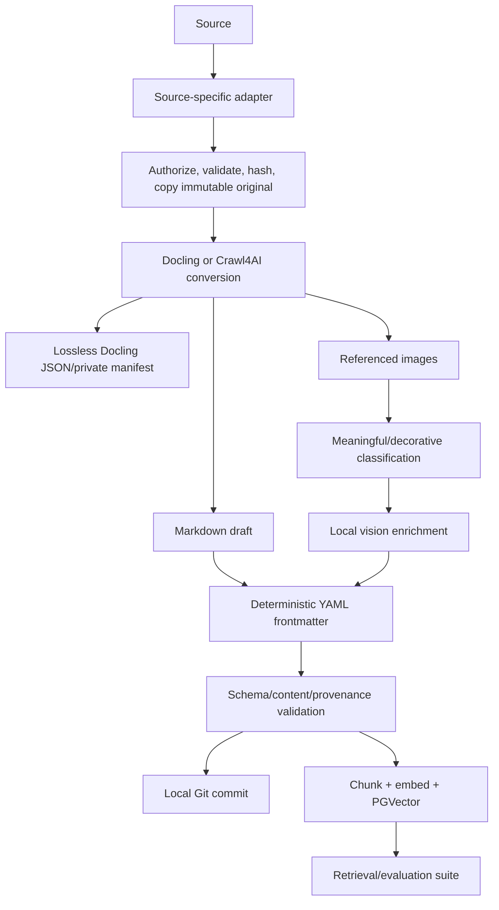

# RAG and Ingestion System Specification

**System ID:** `SYS-RAG`  
**Status:** Approved design; unimplemented  
**Primary phase:** P07  
**Last reviewed:** 2026-09-13

## 1. Responsibility

Create reproducible private knowledge bases from heterogeneous sources without using an LLM for routine scraping, conversion, metadata, filing, hashing, or validation. LLMs are reserved for explicit enrichment and retrieval answers.

## 2. Supported source categories

1. PDF.
2. Microsoft Word (`.docx`).
3. Microsoft Excel (`.xlsx`).
4. Microsoft PowerPoint (`.pptx`).
5. Markdown.
6. Public or explicitly authorized website URLs.
7. Google Docs URLs.
8. Google Sheets URLs.
9. Google Slides URLs.

Legacy Office formats may be evaluated later but are not part of the first acceptance set.

## 3. Tool roles

| Tool | Role |
|---|---|
| Crawl4AI | One-off web capture, JavaScript rendering, deterministic HTML-to-Markdown, CSS/XPath extraction |
| Google Drive API | Authorized export plus file identity and modified-time metadata |
| Docling | Office/PDF normalization, OCR, structure, lossless JSON, Markdown, referenced images |
| Deterministic enricher | YAML frontmatter, hashes, manifests, paths, counts, validation |
| Local vision model | Clearly marked descriptions of meaningful figures, diagrams, and charts |
| Langflow | Visual RAG learning and first capstone flow |
| LangChain/LangGraph | Coded ingestion and agent integrations after concepts are learned |
| PostgreSQL + PGVector | Chunk vectors, metadata, and retrieval indexes |
| MLflow | Trace ingestion, retrieval, generation, latency, decisions, and evaluation |

## 4. Storage boundary

Every knowledge base has a stable ID and independent configuration. Private managed sources and lossless derivatives live outside Git under `H:\ai\knowledge-sources\<id>`. Final Markdown, meaningful assets, schemas, indexes suitable for versioning, and tests live in `H:\ai\knowledge-repos\<id>` as an independent Git repository.

The source tree stores immutable original snapshots, Docling JSON, provenance manifests, and quarantined failures. It is backup-neutral. The first implementation must document OneDrive and private NAS targets without selecting either until the owner decides.

The output repository has no remote by default. Adding a remote is a human-approved action and only private personal or business-organization Git hosting is permitted.

### Runtime boundary

The ingestion coordinator runs as a dedicated Rancher Desktop service, not inside the hardened agent distribution. It receives narrowly scoped mounts for only the managed knowledge-source and knowledge-repository roots. It cannot mount unrelated Windows locations. The owner selects or stages sources through a Windows-facing intake action; the coordinator copies them into immutable managed storage before conversion.

WSL agents may implement and test the ingestion code with synthetic Linux fixtures, but they cannot browse real `H:\ai\knowledge-sources` data. Deployment occurs through the controller's reviewed privileged path. This preserves the WSL trust boundary while allowing deterministic access to the approved Windows storage roots.

## 5. Ingestion flow

Failures are quarantined and do not publish partial Markdown or modify the active index.

## 6. Frontmatter contract

Docling does not natively create the required YAML frontmatter. A deterministic, safe YAML serializer prepends it after conversion. Required fields include schema version, document ID, knowledge-base ID, title, source type, source locator, source file ID when applicable, source modified time, ingestion time, source and content hashes, converter/version, extraction profile, language when known, page/sheet/slide counts where applicable, content counts, classification, collection, tags, and status.

Machine-specific local paths are represented by managed relative paths. Public and private source URLs and Google file IDs may be included because knowledge repositories are private. Secrets, access tokens, cookies, authorization headers, and temporary signed URLs are prohibited.

## 7. Originals, changes, and deletion

- The original source is copied into managed private storage before conversion.
- Reingesting changed content preserves a new immutable original snapshot.
- The stable document ID updates the existing Markdown file; Git history preserves the prior Markdown.
- Duplicate content hashes do not create duplicate documents unless explicitly overridden.
- A missing source becomes `missing` and remains searchable until reviewed.
- Deletion of Markdown, originals, or indexed content requires human approval.
- Ordinary repair and cleanup never destroy an original.

## 8. Visual content

Meaningful charts, diagrams, screenshots, and slide images are stored under `assets/` and referenced from Markdown. Decorative images are omitted. Large assets use Git LFS according to a tested size threshold. A local vision model produces searchable descriptions and chart summaries only after deterministic extraction. Generated descriptions are labeled with model, version, prompt profile, timestamp, and source asset hash; they never replace OCR or source truth.

## 9. Web capture controls

Crawl4AI is the default for one-off capture. Its non-LLM Markdown and CSS/XPath paths are used first. The system records final URL, retrieval time, content hash, status, selected elements, and applicable provenance.

Authenticated capture is Critical risk and case-by-case. Before execution, the owner confirms ownership or permission. Credentials are injected from isolated storage and never logged. The system does not defeat CAPTCHAs, paywalls, access restrictions, robots or contractual prohibitions. A failed authorization check stops the story.

## 10. Google Workspace export

The user supplies a URL and completes OAuth when required. The adapter resolves the Drive file ID, fetches metadata, and exports:

- Docs primarily as Markdown or DOCX, with a comparison fixture selecting the better fidelity path.
- Sheets as XLSX so all sheets are retained; CSV is not the canonical export because Drive limits it to the first sheet.
- Slides as PPTX, with optional PDF used only as a secondary visual reference.

Export choices are verified against current Google documentation at story activation.

## 11. RAG quality

Chunking is content-aware and separately versioned from conversion. The same embedding model and dimension are used for ingestion and queries; a model change requires a named reindex. Evaluation measures source coverage, extraction fidelity, citation correctness, retrieval recall/precision on a curated set, grounded-answer quality, unsupported-claim rate, latency, and storage growth.

The first capstone uses one substantial owner-selected knowledge base. Synthetic fixtures run in this public repository. Final acceptance uses three owner-provided examples for every supported category: 27 inputs total. Those sources and their knowledge output remain in private storage/repositories.

Open WebUI remains the normal end-user interface. Langflow is the visual learning, design, and administrative surface for the capstone. At activation, current supported integration methods are researched and one localhost-only API or tool boundary is selected so the accepted Langflow retrieval flow can be invoked from Open WebUI with citations. Open WebUI's built-in RAG is validated as a small baseline in P04 but is not the authoritative managed-ingestion pipeline for the capstone.

## 12. Acceptance

The pipeline is idempotent, restartable, and transactional at the document level; reproduces unchanged Markdown byte-for-byte; preserves originals and lossless JSON; validates all frontmatter; keeps secrets out of Git; restores from backup; explains every failed input; and passes both synthetic and owner-provided acceptance sets.

## 13. Current references

- [Docling supported formats](https://docling-project.github.io/docling/usage/supported_formats/)
- [Docling CLI and referenced-image export](https://docling-project.github.io/docling/reference/cli/)
- [Docling serialization and Markdown table limitations](https://docling-project.github.io/docling/concepts/serialization/)
- [Crawl4AI documentation](https://docs.crawl4ai.com/)
- [Google Workspace export formats](https://developers.google.com/workspace/drive/api/guides/ref-export-formats)
- [MLflow tracing](https://mlflow.org/docs/latest/genai/tracing)
