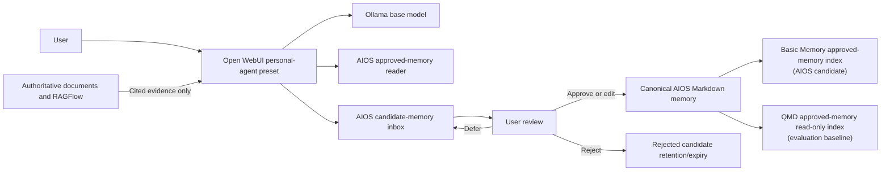

# Personal Agents and AIOS Memory Integration Design

**Status:** Approved design; implementation has not started.

## 1. Purpose

The Local AI Workstation Playbook will document optional personal agents for reflective thinking, life planning, fitness support, financial education, and daily check-ins. The agents run through Open WebUI using the workstation's supported Ollama models.

This design also defines where the playbook meets the separate AIOS project. The playbook supplies inference, agent profiles, and connection guidance. AIOS owns durable personal memory, its canonical files, indexing, review workflow, retention, and governance.

## 2. Scope and Non-Goals

The deliverable covers:

- Personal-agent role definitions and platform-specific model recommendations.
- Open WebUI model presets, system prompts, knowledge attachments, tools, parameters, and optional voices.
- Daily, weekly, and goal-oriented usage patterns.
- A reviewed-inbox interface for candidate memories.
- Memory provenance, sensitivity, isolation, correction, rejection, deletion, backup, and export expectations.
- Connection and verification guidance for an AIOS-owned memory implementation.

The playbook does not:

- Install or select the final AIOS memory engine.
- Maintain a second durable memory database inside the workstation stack.
- Treat a personal agent as a therapist, physician, attorney, fiduciary, tax professional, or crisis service.
- Give an agent banking credentials, brokerage authority, autonomous trading permission, or unrestricted access to unrelated sensitive domains.
- Synchronize memory between the independent Windows and macOS installations. Any future synchronization mechanism is an AIOS decision and must preserve the controls in this contract.

## 3. Ownership Boundary

### Local AI Workstation Playbook owns

- Ollama model availability and performance profiles.
- Open WebUI personal-agent presets.
- Speech, vision, approved web-search, and document-tool configuration.
- The client-side contract for reading approved memory and appending candidate memories.
- Connectivity, permissions, failure messages, and end-to-end verification instructions.

### AIOS owns

- Canonical Git-backed Markdown memory.
- Candidate-memory inbox storage and review state.
- Memory identifiers, schema, indexing, retrieval, promotion, correction, retention, and deletion.
- Backup, restoration, encryption, export, and synchronization decisions.
- Access policy across personal, health, fitness, financial, professional, and audit domains.

AIOS research currently favors Basic Memory as the primary project/agent-memory experiment and QMD as a read-only retrieval baseline. Those are AIOS candidates, not dependencies pinned or installed by this playbook. RAGFlow and the controlled document-conversion pipeline remain the separate authoritative retrieval layer for legal, regulatory, and audit evidence.

## 4. Architecture and Data Flow

1. The agent reads only approved memory in domains permitted for that profile.
2. When the conversation reveals a potentially durable fact, preference, goal, commitment, or correction, the agent may append a candidate.
3. The candidate remains untrusted and must not influence future answers as approved memory.
4. The user approves, edits, rejects, or defers the candidate.
5. AIOS promotes approved content into canonical Markdown and refreshes its replaceable indexes.
6. Corrections supersede prior memories while retaining provenance and history.

If the AIOS memory interface is unavailable, the personal agent continues without durable-memory reads or writes, clearly reports that memory is offline, and does not claim that a candidate was saved.

## 5. Personal Agent Profiles

| Profile | Default Windows model | Default macOS model | Primary behavior |
|---|---|---|---|
| Thought Partner | `qwen3.6:27b` | `gemma4:26b-mlx` | Reflect, clarify, challenge assumptions, and support journaling without impersonating a clinician |
| Life Coach | `qwen3.6:27b` | `gemma4:26b-mlx` | Convert priorities into goals, commitments, reviews, and next actions |
| Fitness Coach | `qwen3.6:27b` | `gemma4:26b-mlx` | Support plans, logs, habits, and image-aware discussion while respecting medical limitations |
| Financial Coach | `qwen3.6:27b` | `gemma4:26b-mlx` | Support budgeting, scenarios, questions, and source-backed education without transactions or professional claims |
| Daily Check-in | `qwen3.5:9b` | `qwen3.5:9b-mlx` | Provide a fast morning/evening review and propose concise candidate memories |

`gpt-oss:20b` is documented as an optional analytical second opinion for structured scenarios. Optional model alternatives remain subject to the playbook's dated model-refresh process and local hardware testing.

Each Open WebUI profile is a lightweight wrapper over a base model. Creating multiple profiles must not duplicate base-model weights.

## 6. Reviewed Inbox Contract

Every candidate memory includes:

- Stable candidate identifier.
- Proposed memory text.
- Creation timestamp and originating agent.
- Source conversation or artifact reference.
- Domain and sensitivity classification.
- Claim type: user-stated, directly observed, source-derived, or agent-inferred.
- Confidence and concise rationale.
- Proposed expiration or review date when appropriate.
- Review status: pending, approved, edited-and-approved, rejected, or deferred.

Rules:

- Agents may append candidates but cannot promote, rewrite, or delete canonical memory.
- Inferences are explicitly labeled and never restated as user-confirmed facts.
- Candidate memories are excluded from normal approved-memory retrieval.
- Promotion is an explicit user action.
- Rejection and deferral are auditable; rejected content follows an AIOS-defined retention period.
- Corrections create a traceable supersession relationship rather than silently erasing history.
- The user can export and request deletion of personal memory through AIOS-owned procedures. Those procedures must explicitly cover canonical files, replaceable indexes, Git history, synchronized copies, and backup-retention windows.

## 7. Domain Isolation and Safety

The initial domains are personal, health, fitness, financial, professional, and audit. Each profile receives the minimum domains it needs. Audit evidence and client information are never placed in personal memory, and personal memories are never added to authoritative audit datasets.

The guides require:

- Localhost-only service defaults.
- Explicit tool and memory-domain permissions per profile.
- No secret, credential, payment-card, authentication-token, or private-key capture.
- Clear labeling of educational versus professional guidance.
- Source dates and citations for time-sensitive financial, medical, legal, or regulatory information.
- Escalation to qualified professionals for consequential decisions.
- No autonomous financial transactions, exercise changes that disregard disclosed limitations, diagnosis, treatment, or crisis counseling.

## 8. Documentation and Prompt Deliverables

- `docs/personal-agents/PERSONAL-AGENTS-GUIDE.md`
- `docs/personal-agents/AIOS-MEMORY-INTEGRATION.md`
- Windows and macOS model/settings tables for every personal-agent profile.
- Open WebUI preset creation, export, backup, restore, and removal instructions.
- Daily check-in, weekly review, goal-planning, fitness-log, financial-scenario, and thought-partner workflows.
- `prompts/personal-agents/` starter prompts for each profile.
- `prompts/memory/review-candidate-inbox.md` for a structured review session.
- Example candidate records using synthetic data only.
- A boundary diagram showing the workstation, AIOS, and authoritative document layers.

## 9. Verification and Acceptance Criteria

The documentation is complete when a user can:

1. Create each Open WebUI profile without downloading duplicate base models.
2. Verify that each profile receives only its permitted memory domains and tools.
3. Conduct a conversation that produces a candidate memory with complete provenance.
4. Confirm the candidate is absent from approved-memory retrieval before review.
5. Approve, edit, reject, and defer synthetic candidates and observe the correct state transitions.
6. Confirm that approved memory becomes retrievable after AIOS indexing.
7. Correct and supersede an approved memory without losing history.
8. Simulate an unavailable memory service and verify graceful, truthful degradation.
9. Demonstrate that personal and audit-domain test records cannot leak across the boundary.
10. Export, back up, restore, and delete synthetic memory using AIOS-owned procedures.

All tests use synthetic personal, health, financial, and audit data. Recommendations based on subjective model behavior are labeled as provisional until compared on the user's Windows and macOS hardware.
