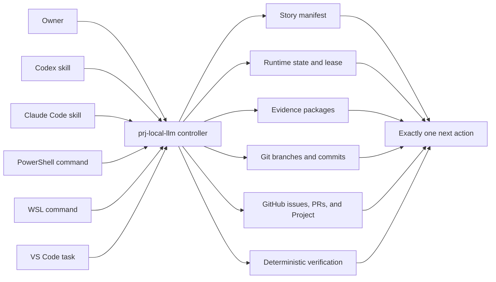

# Local AI Workstation Project Execution Control — Design Specification

**Date:** 2026-09-12

**Status:** Written from the approved design discussion; awaiting repository review

**Repository:** `banksjim/local-llm-setup`

**Initial platform:** Windows 11 with a dedicated Ubuntu WSL2 agent environment

**Operator command:** `prj-local-llm`

## 1. Purpose

This specification defines how the Local AI Workstation Playbook will be implemented reliably over many sessions, reboots, tools, models, and weeks of elapsed time. It converts the approved architecture discussion into an enforceable execution system rather than relying on chat history or an LLM's memory.

The owner is the human authority: they approve privileged phases, complete focused learning and hands-on validation, choose when work may proceed, and may pause work at any time. The project controller is the mechanical orchestrator: it determines the current state, validates prerequisites, selects the next eligible story, prescribes the required tool and model, enforces gates, records evidence, and provides exactly one next action.

The system must be usable without remembering this conversation. From any supported interface, invoking `prj-local-llm` without arguments must reconstruct project status and present one safe, unambiguous next action.

This specification supersedes the execution sequencing, active-platform scope, harness implementation, and project-control assumptions in the older workstation design wherever they conflict. The workstation component architecture remains the starting technical baseline, subject to mandatory story-level research and later approved revisions.

## 2. Active Program Scope

### 2.1 Included now

The first execution program covers Windows only and includes:

- A durable parent plan and small, independently executable and testable user stories.
- The `prj-local-llm` project controller and its state, quality, recovery, and evidence systems.
- Codex, Claude Code, PowerShell, WSL Ubuntu, GitHub, and VS Code interfaces to the same controller.
- Just-in-time learning gates before each major new concept.
- WSL2-based agent development with the Windows host protected by explicit boundaries.
- The Local AI workstation stack: Ollama, Rancher Desktop integration, Open WebUI, SearXNG, Docling, local speech-to-text, storage, backup, maintenance, and verification.
- A dedicated VS Code profile and targeted extensions for WSL, Python, Go, Node.js, and TypeScript development.
- An agent laboratory built around LangChain, LangGraph, MCP, skills, assets, scripts, and self-hosted MLflow observability.
- Personal-agent design and later staged memory experimentation after the base agent laboratory is understood and proven.
- A learning roadmap from practical agent implementation toward a future software-factory decision.

### 2.2 Deferred

- macOS implementation stories. The MacBook Pro plan remains a required later program, but it begins only after the Windows implementation and learning outcomes are reviewed.
- A coding software factory, TrueForge, or another multi-agent coding harness implementation.
- A production long-term personal-memory system.
- Any architecture branded or treated as "AIOS."

The deferred items may have roadmap entries but must not be installed or represented as current implementation work.

## 3. Governing Principles

1. **Durable state, not conversational memory.** A new LLM session must reconstruct the project from repository state, Git, evidence, and GitHub.
2. **One command to regain orientation.** Bare `prj-local-llm` is read-only and always explains the next action.
3. **One active writer.** Codex, Claude Code, local agents, and humans may inspect concurrently, but only one controller lease may authorize mutation.
4. **No silent execution.** Only `go`, issued by the owner, authorizes a new execution interval.
5. **Resume is not go.** `resume` reconstructs and reconciles state, performs only predefined safe repairs, and stops in `PAUSED` or `READY`.
6. **Small stories.** Each implementation story has one bounded outcome, one branch or worktree, explicit tests, evidence, and rollback.
7. **No self-attested completion.** The model that performs work cannot be the sole authority that declares it complete.
8. **Risk-proportional gates.** Documentation does not receive the same ceremony as credentials, networking, or privileged host changes.
9. **Current sources at the point of use.** Research is refreshed from primary documentation before recommendations or implementations that can drift.
10. **Provider independence.** Codex, Claude Code, PowerShell, WSL, VS Code, and eventually qualified local models use one state machine and controller contract.
11. **Local-model trust is earned.** A downloaded model remains unavailable for project execution until it passes role-specific qualification.
12. **Operations are idempotent, logged, and reversible.** Repeating a completed operation must be safe; material changes require rollback evidence.
13. **One approval per privileged phase.** After approval, the controller may perform only the documented, bounded operations in that phase.
14. **No paid-usage surprises.** Controllers cannot purchase credits, enable automatic replenishment, or silently select a prohibited or high-cost model.

## 4. Architecture

The controller is deterministic software. LLM skills are thin adapters that interpret its structured results and perform a bounded role. They do not maintain parallel state machines.

### 4.1 Planned component boundaries

| Component | Responsibility | Must not do |
|---|---|---|
| Controller core | State transitions, eligibility, locking, command dispatch, exit codes | Generate project decisions from free-form guesses |
| Story manifest | Sequence, dependencies, risk, model route, gates, acceptance contract | Store secrets or transient process state |
| Runtime state | Current story, phase, checkpoint, lease, pending state | Override committed requirements |
| Evidence store | Test results, diffs, reviews, approvals, before/after snapshots | Treat prose assurances as proof |
| Provider adapter | Translate Codex or Claude invocation into controller operations | Reimplement controller rules |
| GitHub synchronizer | Mirror issues, PRs, status, and current action | Become the only source of truth |
| Verification engine | Execute schema, policy, test, drift, and acceptance checks | Waive a failed gate |
| Learning gate | Present focused material and record owner completion | Pretend the LLM completed human learning |

## 5. Command Contract

Formal syntax uses `prj-local-llm <command> [arguments...]`; angle brackets denote required values and square brackets denote optional values. Those characters are not typed in examples.

### 5.1 Cross-interface invocation

| Interface | Example |
|---|---|
| Codex | `$prj-local-llm status` |
| Claude Code | `/prj-local-llm status` |
| PowerShell | `prj-local-llm status` |
| WSL Ubuntu | `prj-local-llm status` |
| VS Code | Task or command-palette item mapped to the same command |

### 5.2 User-facing commands

| Command | Behavior |
|---|---|
| no command | Read-only orientation; reconcile safe observations and display exactly one next action |
| `status` | Show current phase, story, state, lease, gates, approvals, tests, branch, model route, and usage guard |
| `next` | Explain the next eligible action without starting it |
| `model` | Show the required provider, model, effort, reason, fallback, prohibited substitutions, and switching instructions |
| `go` | Validate the preflight contract and start or continue one authorized execution interval |
| `pause` | Request a stop at the nearest safe atomic checkpoint, persist state, release the lease, and report the next action |
| `resume` | Reconstruct state after an ordinary return, crash, or reboot; perform safe reconciliation; never start implementation |
| `review <story-id>` | Enter the review role for a completed implementation and record a verdict and findings |
| `verify [story-id]` | Run deterministic gates for one story or the current story |
| `complete-gate <story-id>` | Record owner-supplied evidence for an explicit human learning, test, or approval gate |
| `audit` | Check global consistency, drift, missing evidence, stale research, Git state, and policy compliance |
| `sync` | Reconcile the local authoritative plan with GitHub issues, pull requests, and Project fields |
| `help [command]` | Explain commands and examples without changing state |

There is no user-facing `recover` command. Recovery is part of `resume`.

### 5.3 Bare-command next-action contract

Invoking `prj-local-llm` without arguments must:

1. Locate the project root without relying on the current chat.
2. Load and validate the manifest, schemas, runtime state, and latest checkpoint.
3. Compare the recorded state with Git and locally observable execution artifacts.
4. Read GitHub state when authenticated and reachable, while remaining useful offline.
5. Detect ambiguity rather than select arbitrarily.
6. Present current state, whether anything is running, and exactly one `DO THIS NEXT` instruction.
7. Include the exact interface, provider, model, reasoning setting, command, learning item, or human action required.
8. Exit without changing workflow, Git, GitHub, installed software, configuration, or approval state. It may append a sanitized local observation log.

The same next action must be mirrored in a pinned GitHub Project item, the current issue, the most recent execution summary, a root `START-HERE.md`, and a VS Code task named **Local AI Project: What Do I Do Next?**

## 6. Lifecycle and State Machine

### 6.1 Execution states

- `NOT_STARTED`
- `READY`
- `RUNNING`
- `PAUSE_REQUESTED`
- `PAUSED`
- `AWAITING_LEARNING`
- `AWAITING_APPROVAL`
- `AWAITING_HUMAN_TEST`
- `AWAITING_REVIEW`
- `TESTING`
- `BLOCKED`
- `READY_TO_MERGE`
- `COMPLETE`
- `SUPERSEDED`

Every transition has explicit preconditions, allowed actors, required evidence, and a resulting next action. Invalid transitions fail closed.

### 6.2 GitHub Project presentation

The personal GitHub Project owned by `banksjim` mirrors understandable workflow values:

- Planned
- Locked
- Ready
- Learning
- Awaiting You
- In Progress
- Testing
- Review
- Blocked
- Paused
- Done
- Superseded

`Locked` means a story exists but may not execute because one or more dependencies, learning gates, approvals, reviews, or explicit start authority are incomplete.

### 6.3 Start, pause, and resume

- A conversational "go" or explicit `prj-local-llm go` authorizes only the next controller-defined execution interval.
- `pause` is accepted immediately, but an in-progress operation may finish its smallest safe atomic unit before stopping.
- `resume` acquires an inspection lease, validates the previous checkpoint, reconciles safe drift, reports discrepancies, sets `PAUSED` or `READY`, and releases the lease.
- After `resume`, a separate `go` is always required to execute.
- Repeated failures, architecture invalidation, missing authority, unsafe drift, or ambiguous state move the project to `BLOCKED` rather than encouraging improvisation.

## 7. Durable State and Precedence

The planned hierarchy is:

1. Approved specifications and policy schemas in Git.
2. Sequenced story manifest and immutable story identifiers in Git.
3. Accepted story evidence and completion records in Git.
4. Atomic local runtime checkpoint and append-only event log.
5. Git branches, commits, tags, and worktrees.
6. GitHub issues, pull requests, and Project as a synchronized human-facing mirror.
7. Chat transcripts as optional context only, never authority.

Conflicts are resolved conservatively. Committed policy cannot be overridden by a GitHub card or model assertion. A runtime checkpoint cannot claim completion without the required evidence. GitHub outages do not erase local progress, and synchronization never overwrites unexplained remote changes.

Runtime state must be written atomically. Accepted evidence must exclude secrets and include hashes or stable identifiers sufficient to detect alteration. The implementation plan will choose the exact serialization formats and tracked/ignored boundaries.

## 8. Lease and Concurrency

Only one mutation lease may exist for the project. The lease records:

- Story and role.
- Provider and model.
- Process and host identity where observable.
- Acquisition and heartbeat times.
- Current atomic operation.
- Safe checkpoint and expiration policy.

Other tools may run read-only commands while a lease exists. A reviewer receives a separate read-only review role and cannot rewrite the implementation under review. A stale lease is never deleted solely because time passed; `resume` must verify that no process or incomplete external action remains before safe takeover.

## 9. Story Contract

Each story is a separate, small document plus a machine-readable manifest entry. Required fields are:

- Stable ID, title, phase, sequence, and dependencies.
- User value and bounded objective.
- Learning objective and blocking learning story, if applicable.
- Current primary-source research requirements and freshness window.
- Preconditions and unlock conditions.
- In-scope files, services, systems, and external mutations.
- Explicit non-goals and prohibited changes.
- Privilege and human-approval classification.
- Risk level.
- Provider, model, effort, budget, and permitted fallback.
- Implementation procedure or executable outcome contract.
- Automated acceptance tests.
- Human validation when required.
- Idempotency and rollback requirements.
- Expected evidence.
- Definition of done.
- Pause-safe boundaries.

Each implementation story uses its own branch or worktree and normally produces one focused commit. The orchestrator merges only after all gates pass.

## 10. Learning System

A dedicated human learning story precedes every major new concept. It may contain multiple focused parts but must teach only what is needed for this project. It blocks the dependent implementation stories until the owner records completion.

Every learning story includes:

- Why the concept matters in the current architecture.
- Current official documentation.
- A recently verified short conceptual video when a high-quality one exists.
- A recently verified deeper tutorial when appropriate.
- A small hands-on exercise.
- A short explain-back or observable check.
- The exact next implementation story it unlocks.

Learning areas include the controller, Git/GitHub workflow, WSL boundary, Rancher Desktop, Ollama, Open WebUI, local models and quantization, SearXNG, Docling, speech-to-text, VS Code Remote WSL, Python/Go/Node/TypeScript toolchains, agent concepts, LangChain, LangGraph, MCP, skills/assets/scripts, MLflow tracing and evaluation, and later personal-agent and memory concepts.

The owner does not need a general course on VS Code, containers, or every product feature.

## 11. Model Routing and Manual Switching

The owner normally switches models manually at story boundaries. The controller makes the decision visible; the owner does not memorize the routing table.

`next`, `model`, and the bare command must display:

- Required interface and provider.
- Exact model and effort.
- Why it was selected.
- Budget class.
- Allowed fallback and escalation trigger.
- Whether an independent reviewer is required.
- Exact command to run after switching.

If the active model cannot be detected reliably, `go` requires an explicit confirmation. Model switching never occurs silently during an atomic operation.

### 11.1 September 2026 baseline

| Work category | OpenAI/Codex route | Anthropic/Claude route | Local route |
|---|---|---|---|
| Architecture and security design | GPT-5.6 Sol, medium | Claude Sonnet 5, medium | Unavailable initially |
| Ordinary implementation | GPT-5.6 Terra, medium | Claude Sonnet 5, medium | Eligible only after qualification |
| Routine documentation and mechanical work | GPT-5.6 Luna, low or medium | Claude Haiku 4.5 | Eligible only after qualification |
| Difficult failure investigation | GPT-5.6 Sol; high only when justified | Claude Sonnet 5; high only when justified | Advisory only during probation |
| Independent review | Different session/model/provider appropriate to risk | Different session/model/provider appropriate to risk | Cloud review required during probation |
| Exceptional escalation | GPT-6 Astra only with owner approval | Cross-provider escalation | Not automatically authorized |

Hard restrictions:

- Claude Opus 5 is prohibited.
- Claude Fable is prohibited because the owner does not have access.
- No Opus-family model is required by the baseline.
- Astra, `max`, or `ultra` reasoning requires explicit owner approval.
- No adapter may purchase credits or enable automatic credit replenishment.
- Availability and current guidance must be refreshed before story generation and at declared drift checkpoints.

### 11.2 Usage safeguards

- Budget classes are `SMALL`, `NORMAL`, and `EXPENSIVE`.
- Warn when either known included-usage window reaches 70 percent.
- Do not start a new story at or above 85 percent without the owner's explicit override.
- Save a resumable checkpoint before stopping for usage.
- Prefer the least expensive model and effort that has passed representative evaluations for the role.
- Escalate only after deterministic failures and captured evidence, not simply because an LLM asks for a larger model.

### 11.3 Local-model transition

Local models begin as `UNAVAILABLE`, because Ollama and the models do not exist during bootstrap. Cloud models perform early learning support, controller work, and infrastructure installation.

After Ollama and candidate models are operational, dedicated qualification stories test instruction following, structured output, repository comprehension, tool use, code modification, tests, uncertainty handling, latency, and resource use. Passing a role-specific threshold changes that model to `PROBATION`, then `QUALIFIED` after supervised successful stories. Privileged operations and final review remain cloud- or human-gated until separately authorized.

## 12. Quality Enforcement

Quality is enforced by deterministic controls and evidence, not by an LLM's confidence.

### 12.1 Risk levels

| Level | Typical work | Minimum controls |
|---|---|---|
| Q1 | Documentation | Schema/link/static validation and lightweight review |
| Q2 | Scripts and development configuration | Unit tests, idempotency, scope check, independent fresh-session review |
| Q3 | Containers, networking, models, and services | Integration tests, rollback, cross-provider review |
| Q4 | Credentials, security boundaries, privileged host changes | Explicit phase approval, isolated checks, rollback rehearsal, cross-provider review, human acceptance |

An executing model may raise a risk level but cannot lower it. A reduction requires owner approval and a durable rationale.

### 12.2 Required gates

Applicable gates include:

1. Story schema and dependency validation.
2. Primary-source research freshness.
3. Declared-scope comparison.
4. Formatting, linting, static analysis, parsing, and unit tests.
5. Secret scanning and unsafe-operation policy.
6. Idempotency execution or safe simulation.
7. Adjacent-component integration verification.
8. Rollback execution or justified safe rehearsal.
9. Independent review.
10. Human acceptance where required.
11. Evidence completeness.
12. Git and pull-request checks.

The implementer cannot be the sole reviewer. Failed gates return the story to work or block it; they cannot be waived by prose.

### 12.3 Evidence package

Each completed story records:

- Exact story revision.
- Provider, model, effort, and role.
- Sources and review dates.
- Branch, commit, and changed-file inventory.
- Operations performed and relevant sanitized output.
- Test results.
- Before/after state.
- Idempotency and rollback evidence.
- Independent review verdict and findings.
- Human acceptance when required.
- Final controller decision.

### 12.4 Independent review workflow

Agents work sequentially through durable artifacts, not by remaining online together:

1. The implementer completes a story, tests it, records evidence, releases its lease, and stops at `AWAITING_REVIEW`.
2. The bare command tells the owner which tool, model, and review command to use.
3. The reviewer reads the story, diff, tests, and evidence in a fresh context and records `PASS` or findings.
4. The controller selects correction, human testing, or merge as the next action.

Q1 work uses lightweight review. Q2 permits a fresh independent session on the same provider. Q3 requires cross-provider review. Q4 requires cross-provider review plus owner acceptance. A temporary provider outage leaves the project safely waiting unless the owner approves a documented exception permitted by policy.

## 13. Privileged Phases and Human Gates

Privileged work is grouped into bounded phases. Each phase begins with a preview showing exact intended changes, affected paths and services, risks, estimated duration, rollback, and validation. One explicit approval authorizes only that phase.

Human stories are first-class sequenced stories for:

- Learning completion.
- Privileged installation approval.
- Visual or experiential validation.
- Authentication performed by the owner.
- Hardware behavior that cannot be proven from repository-local tests.
- Review of architecture-changing discoveries.
- Destructive or difficult-to-reverse exceptions.

The controller must never fabricate human completion evidence.

## 14. Failure Handling and Resume

`resume` must distinguish:

- Clean pause.
- Process crash before mutation.
- Process crash during an atomic operation.
- Completed operation with missing checkpoint.
- Local/GitHub disagreement.
- Stale lease.
- Uncommitted or unexpected changes.
- Missing dependency or service.
- Research or model recommendation that expired while paused.
- Ambiguous state requiring owner judgment.

Safe repairs are predefined, idempotent, logged, and non-destructive. Examples include regenerating a derived summary from authoritative state or releasing a lease after proving the owning process is absent and no operation is incomplete. The controller must stop for unexplained filesystem changes, uncertain external mutations, missing approval, credentials, destructive recovery, or architecture-invalidating drift.

Retries are bounded and classified. Repeating the same failing operation without new evidence is prohibited.

## 15. Controller Bootstrap and Trust Establishment

No workstation software installation may begin until the controller earns `TRUSTED` status through its own staged bootstrap:

1. Commit this approved design specification.
2. Produce the detailed implementation plan and sequenced bootstrap stories.
3. Implement read-only manifest validation, `status`, `next`, and bare-command orientation.
4. Implement atomic state, append-only events, and lease handling.
5. Implement `pause`, `resume`, and reconciliation.
6. Implement `go`, human gates, verification, audit, and synchronization.
7. Add Codex, Claude Code, PowerShell, WSL, and VS Code adapters.
8. Execute deterministic tests and deliberate failure injection.
9. Obtain independent Claude Sonnet 5 review of the Sol-authored design and controller work.
10. Complete a guided owner acceptance drill.
11. Tag the accepted controller baseline and mark it `TRUSTED`.

Failure-injection acceptance includes interrupted execution, corrupt state, stale lease, uncommitted changes, GitHub unavailable, WSL stopped, Rancher Desktop stopped, wrong model confirmation, incomplete approval, duplicate writers, and rollback of a simulated failed operation.

## 16. Required Documentation

The controller program must eventually deliver:

- `START-HERE.md`: zero-context entry point.
- `docs/operations/PROJECT-EXECUTION-CONTROL.md`: owner operating manual.
- `docs/operations/OPERATOR-QUICK-REFERENCE.md`: concise command reference.
- `docs/architecture/CONTROLLER-TECHNICAL-SPECIFICATION.md`: state, locking, formats, and interfaces.
- `docs/implementation/CODEX-CONTROLLER-IMPLEMENTATION.md`: self-contained Codex adapter specification.
- `docs/implementation/CLAUDE-CODE-CONTROLLER-IMPLEMENTATION.md`: self-contained Claude-optimized skill specification.
- `docs/operations/MODEL-ROUTING-AND-BUDGETS.md`: provider/model assignments and safeguards.
- `docs/operations/BOOTSTRAP-TO-LOCAL-EXECUTION.md`: local-model qualification and staged delegation.
- `docs/operations/QUALITY-ENFORCEMENT.md`: gates, evidence, risk, review, and exceptions.
- `docs/learning/`: targeted blocking learning modules and progress instructions.
- `prompts/`: reusable prompts for implementation, review, learning, research, troubleshooting, and maintenance.

The Claude document must be sufficient to give to Claude Code in a fresh session to implement or validate `/prj-local-llm` without relying on Codex chat history. The Codex document has the equivalent requirement.

## 17. Verification Strategy

### 17.1 Repository-local verification

- Schema validation for manifests, stories, state, and evidence.
- PowerShell analysis and tests.
- Linux wrapper linting and tests where applicable.
- Cross-adapter contract tests proving identical controller requests and structured results.
- Markdown link and required-section checks.
- Secret scanning.
- Deterministic fixture repositories for Git and worktree behavior.
- Mocked GitHub integration plus an explicitly authorized live smoke test.
- Idempotency tests for every state transition and safe repair.
- State-machine transition coverage, including invalid transitions.
- Concurrent-process tests proving a second writer is rejected.
- Failure injection and resume tests.
- Golden semantic fixtures for next-action selection; tests must validate fields and invariants rather than exact prose.

### 17.2 Owner acceptance drill

The owner is guided through a disposable simulation that proves they can:

1. Invoke the bare command from zero context.
2. Follow a learning gate.
3. Start a harmless story.
4. Pause and close the session.
5. Resume from another supported interface.
6. Switch to the prescribed reviewer.
7. Record a human gate.
8. Observe a deliberate rejection caused by a missing prerequisite or wrong model.
9. Complete the simulated story and verify GitHub synchronization.

The controller remains `UNTRUSTED` until both automated tests and the owner drill pass.

## 18. Acceptance Criteria

This design is successfully implemented when:

1. Bare `prj-local-llm` reliably reconstructs status and returns exactly one safe next action from every supported interface.
2. A new Codex or Claude session can continue solely from repository and synchronized project artifacts.
3. `resume` handles ordinary return, crash, and reboot without starting work.
4. Only `go` authorizes an execution interval.
5. Concurrent writers are prevented and stale leases fail safely.
6. Every story is schema-valid, independently testable, reversible where applicable, and produces evidence.
7. Risk-based review and human gates cannot be silently bypassed.
8. Model routing is explicit, budget-aware, manually confirmed when necessary, and enforces the Opus 5 and Fable prohibitions.
9. Local models receive no work before qualification and supervised probation.
10. The GitHub Project visibly mirrors current status and next action without becoming the sole authority.
11. The controller passes failure injection, idempotency, cross-interface, and owner acceptance tests before any workstation installation begins.
12. Documentation lets the owner operate the project without remembering this conversation.

## 19. Current Primary References

These sources were checked on 2026-09-12. Story-level research must refresh relevant sources again when its freshness policy requires it.

- [OpenAI: Build skills](https://developers.openai.com/codex/skills)
- [OpenAI model catalog](https://developers.openai.com/api/docs/models)
- [OpenAI model guidance](https://developers.openai.com/api/docs/guides/latest-model)
- [Anthropic: Extend Claude with skills](https://code.claude.com/docs/en/skills)
- [Anthropic: Claude Code commands](https://code.claude.com/docs/en/commands)
- [Anthropic: Claude Code plugins](https://code.claude.com/docs/en/plugins)
- [Anthropic: Claude Sonnet 5](https://www.anthropic.com/news/claude-sonnet-5)
- [Anthropic: Claude Haiku 4.5](https://www.anthropic.com/news/claude-haiku-4-5)

## 20. Non-Goals of the Controller

- It is not a general-purpose project-management product.
- It does not replace Git, GitHub, GitHub Projects, Codex, Claude Code, VS Code, or the future local agent runtime.
- It does not make autonomous architectural changes.
- It does not remove the owner's approval role.
- It does not keep cloud agents running continuously.
- It does not permit simultaneous competing orchestrators.
- It does not guarantee that an LLM is correct; it creates observable, testable gates that prevent unsupported claims from becoming accepted project state.
